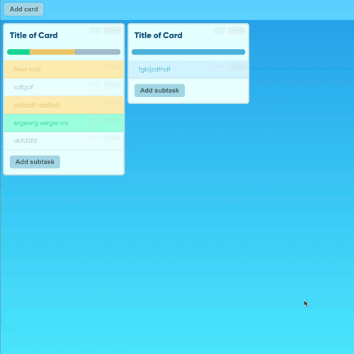

### [Demo](https://max-0n.github.io/task_manager/)


  

 


[](https://max-0n.github.io/task_manager/)

# Task manager

## Build project
```
npm run build
```

## Run in development mode
```
npm start
```
